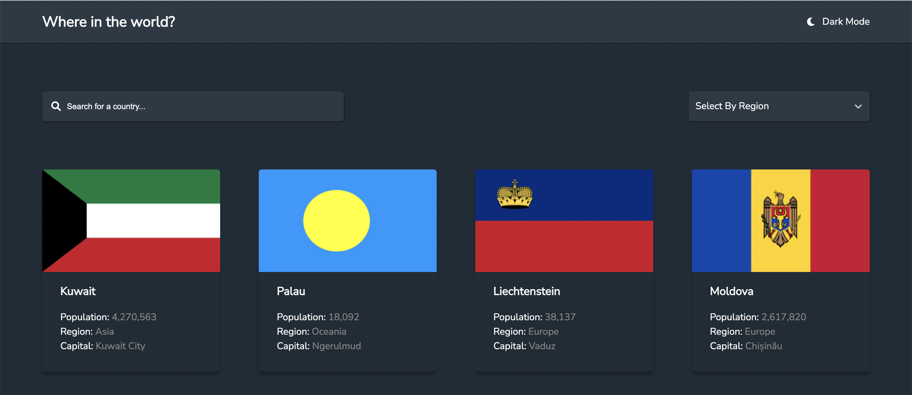
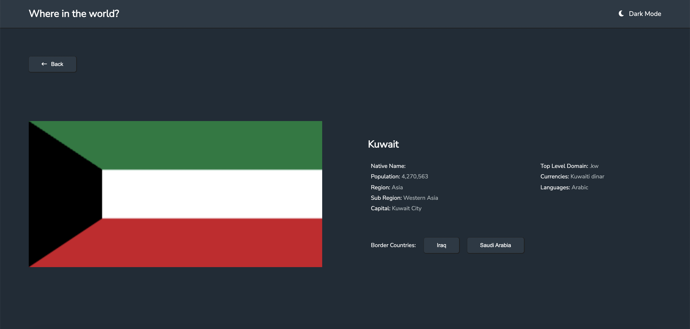

# Frontend Mentor - REST Countries API with color theme switcher solution

## Table of contents

- [Overview](#overview)
  - [The challenge](#the-challenge)
  - [Screenshot](#screenshot)
  - [Links](#links)
- [My process](#my-process)
  - [Built with](#built-with)
- [Author](#author)

## Overview

### The challenge

Users should be able to:

- See all countries from the API on the homepage
- Search for a country using an `input` field
- Filter countries by region
- Click on a country to see more detailed information on a separate page
- Click through to the border countries on the detail page
- Toggle the color scheme between light and dark mode

### Screenshot

.png)

.png)

### Links

- Solution URL: [Github](https://github.com/mridulsikka141090/country-finder)
- Live Site URL: [Github Pages](https://mridulsikka141090.github.io/country-finder)

## My process

### Built with

- Semantic HTML5 markup
- CSS custom properties
- Flexbox
- CSS Grid
- [React](https://reactjs.org/) - JS library
- [SASS](https://sass-lang.com/) - For styles
- [React-Select](https://react-select.com/home)

## Author

- Frontend Mentor - [@mridulsikka1401090](https://www.frontendmentor.io/profile/mridulsikka141090)

